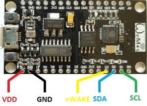
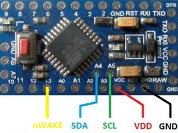
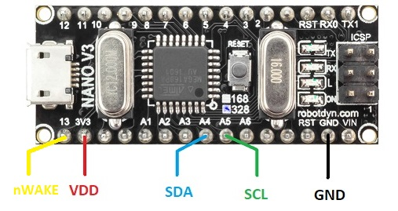
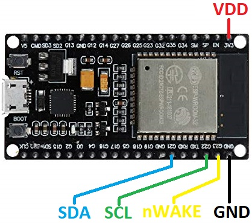
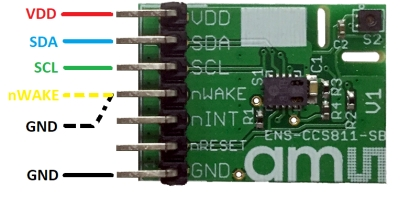
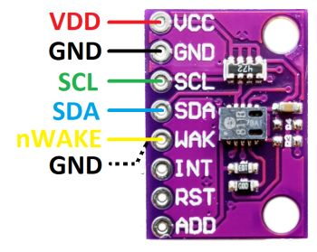

# CCS811
Arduino library for the CCS811 digital gas sensor for monitoring indoor air quality from ams.


## Introduction
This project is an Arduino *library*. It implements a driver for the CCS811.
This chip is a indoor air quality sensor module with an I2C interface.

This library includes a CCS811 driver and some [examples](examples).
When starting, use the example [ccs811basic](examples/ccs811basic).
It is the most simple one, but it helps in getting the wiring correct: the I2C wires, the ADDR select pin and the nWAKE pin.
There is also a full fledged example: it reads environmental data from ENS210, writes that to the CCS811, 
reads the gas data from the CCS811, and then uploads that to ThingSpeak.

If you have an old CCS811, you might want to update its firmware. 
This library contains an example for that too: [ccs811flash](examples/ccs811flash).

The rest of this page tells how to get started on the software (install library) and hardware (wiring).


## Links
The CCS811 is made by [ams](https://www.ams.com). 
 - Find the datasheet of the CCS811 on the
   [product page](https://ams.com/ccs811).
 - Find application notes and software on the
   [Technical Documents](http://ams.com/ccs811#tab/documents) tab.
 - Find the latest in-chip firmware on the
   [Tools & Support](http://ams.com/ccs811#tab/tools) tab: CCS811_SW000246_x-xx.bin.


## Software
This section gives a quick overview of how to install this library and compile one of its 
examples ([ccs811basic](examples/ccs811basic)). The end of this file shows an actual run of that example.

### Prerequisites
It is assumed that
 - The Arduino IDE has been installed.
   If not, refer to "Install the Arduino Desktop IDE" on the
   [Arduino site](https://www.arduino.cc/en/Guide/HomePage).
 - The Arduino library directory is at its default location.
   For me, Maarten, that is `C:\Users\maarten\Documents\Arduino\libraries`.


### Installation
Installation steps
 - Visit the [project page](https://github.com/maarten-pennings/CCS811) for the Arduino CCS811 library.
 - Click the green button `Clone or download` on the right side.
 - From the pop-up choose `Download ZIP`.
 - In Arduino IDE, select Sketch > Include Library > Manage Libraries ...
   and browse to the just downloaded ZIP file.
 - When the IDE is ready this `README.md` should be located at e.g.
   `C:\Users\maarten\Documents\Arduino\libraries\CCS811\README.md`.


### Build an example
To build an example sketch (just building, for running it we need to wire it, and that is the next step):
 - (Re)start Arduino.
 - Open File > Example > Examples from Custom Libraries > CCS811 > ccs811basic.
 - Make sure Tools > Board lists the correct board.
 - Select Sketch > Verify/Compile.


## Hardware
This library has been tested with
 - [NodeMCU (ESP8266)](https://www.aliexpress.com/item/NodeMCU-V3-Lua-WIFI-module-integration-of-ESP8266-extra-memory-32M-flash-USB-serial-CP2102/32779738528.html)
 - [Arduino Pro Mini](https://www.aliexpress.com/item/ProMini-ATmega328P-3-3V-Compatible-for-Arduino-Pro-Mini/32525927539.html)
 - [Arduino Nano](https://www.aliexpress.com/item/Nano-CH340-ATmega328P-MicroUSB-Compatible-for-Arduino-Nano-V3/32572612009.html) see [WARNING] below
 - [ESP32](https://www.aliexpress.com/item/ESP-32S-ESP-32-Development-Board-WiFi-Wireless-Bluetooth-Antenna-Module-For-Arduino-2-4GHz-Dual/32827838651.html)

Note that the CCS811 requires a supply voltage of 1.8V .. 3.6V.
So, 3.3V is ok, but *do not use a 5V board*.
The Nano has 3v3 out pin, but runs I2C on 5V. This poses a risk for the CCS811. 
Also note that the minimum supply voltage of the CCS811 is 1.8V and should not drop below this value for
reliable device operation.

Most micro controllers seem to have built-in pull-ups for I2C.
However, those pull-ups are typically activated by `Wire.begin()`.
Therefore, between power-up (or reset) and `Wire.begin()`, the I2C lines might not be high.
This might cause unwanted behavior on the slaves. 
It is recommended to add 10k pull-ups on both SDA and SCL.


### Wiring
The CCS811 has several pins:
 - VDD must be connected to 3V3.
 - GND must be connected to GND.
 - SDA must be connected to SDA of micro (and maybe a pull-up, but the below micros have that internally).
 - SCL must be connected to SCL of micro (and maybe a pull-up, but the below micros have that internally).
 - nWAKE can either be tied to GND, in which case the CCS811 is always awake (using more power).
   Alternatively nWAKE can be tied to a GPIO pin of the micro, the CCS library will then use this pin to wake-up the micro when needed.
   In the former case pass -1 to the constructor `CCS811 ccs811(-1)`, in the latter case, pass the pin number, e.g. `CCS811 ccs811(D3)`.
 - nINT can be left dangling, interrupts are not used by the library.
 - nRESET can be left dangling, it is not used by the library (the library employs a software reset).
 - When ADDR is connected the GND, the CCS811 has slave address 0x5A (constant `CCS811_SLAVEADDR_0`).
   When ADDR is connected the VDD, the CCS811 has slave address 0x5B (constant `CCS811_SLAVEADDR_1`).
   If your board has an ADDR pin, then likely it has a pull-up, so leaving it dangling selects 0x5B.
   If your board has no ADDR pin, then likely it has the pin tied to GND, selecting 0x5A.
   The `ccs811.begin()` uses the address passed in the constructor, but if the other address does work, 
   it prints this on Serial.


### ESP8266
For the NodeMCU (ESP8266), connect as follows (I did not use pull-ups, presumably they are inside the MCU).
The SDA and SCL could be mapped to other pins, but these are the default in the Arduino wire library.

| CCS811  |  ESP8266  |
|:-------:|:---------:|
|   VDD   |    3V3    |
|   GND   |    GND    |
|   SDA   |    D2     |
|   SCL   |    D1     |
| nWAKE   | D3 or GND |



Unfortunately, the CCS811 uses clock stretching, and the I2C sw library in the ESP8266 (up to version 2.4.2)
can not handle this in all cases, therefore this library add waits (see `set_i2cdelay()` in `ccs811.h`).

However, the real solution is to fix the clock stretch problem in the ESP8266 core libraries.
I have submitted an [issue](https://github.com/esp8266/Arduino/issues/5340) for that, which is included 
in core library version 2.5.0. I submitted and another [issue](https://github.com/esp8266/Arduino/issues/5528), 
which is not yet released. My suggested do-it-yourself solution is described 
[here](https://github.com/maarten-pennings/I2C-tool/blob/master/I2Ctest8266/README.md#how-to-fix)


### Pro Mini
For the Pro Mini (do *not* use a 5V board), connect as follows  (I did not use pull-ups, presumably they are inside the MCU).

| CCS811  |  Pro mini |
|:-------:|:---------:|
|   VDD   |    VCC    |
|   GND   |    GND    |
|   SDA   |     A4    |
|   SCL   |     A5    |
| nWAKE   | D3 or GND |




### Arduino Nano
The Nano has 3v3 supply, but runs I2C on 5V. This does seem to work, but might be risky for the CCS811.
For the Arduino Nano, connect as follows  (I did not use pull-ups, presumably they are inside the MCU).

| CCS811  |    Nano   |
|:-------:|:---------:|
|   VDD   |    3V3    |
|   GND   |    GND    |
|   SDA   |     A4    |
|   SCL   |     A5    |
| nWAKE   | D3 or GND |



[WARNING] The Nano board has a 3v3 supply pin, but the micro controller itself runs on 5V. 
Since the CCS811 datasheet specifies that logic high is at most 1.0 x VDD (i.e. 3v3), 
connecting the CCS811 to the I2C pins of the Nano (at 5V) is a risk for the CCS811.


### ESP32
For the ES32, connect as follows (I did not use pull-ups, presumably they are inside the MCU).
The SDA and SCL could be mapped to other pins, but these are the default in the Arduino wire library.

| CCS811  |   ESP32   |
|:-------:|:---------:|
|   VDD   |    3V3    |
|   GND   |    GND    |
|   SDA   |     21    |
|   SCL   |     22    |
| nWAKE   | 23 or GND |



The ESP32 has, unlike its predecessor ESP8266, an I2C interface in hardware. 
However, the Arduino library version 1.0.0 has a 
[bug](https://github.com/platformio/platform-espressif32/issues/126): 
it does not support repeated start conditions. 
However, this seems to be fixed in release 1.0.1, so use that.


### CCS811
Connect the official ams CCS811 module, which also has an ENS210, as follows



An alternative is a CCS811-only board (without and ENS210). Wire it as follows




## Run an example
To build, flash and run an example sketch
 - (Re)start Arduino.
 - Open File > Example > Examples from Custom Libraries > CCS811 > ccs811basic.
 - Make sure Tools > Board lists the correct board.
 - Select Sketch > Upload.
 - Select Tools > Serial Monitor.
 - Enjoy the output, which should be like this for `ccs811basic`:

     ```Text
     setup: Starting CCS811 basic demo
     setup: ccs811 lib  version: 10
     setup: hardware    version: 12
     setup: bootloader  version: 1000
     setup: application version: 2000
     CCS811: waiting for (new) data
     CCS811: waiting for (new) data
     CCS811: waiting for (new) data
     CCS811: waiting for (new) data
     CCS811: eco2=400 ppm  etvoc=0 ppb  
     CCS811: eco2=405 ppm  etvoc=0 ppb  
     CCS811: eco2=405 ppm  etvoc=0 ppb  
     CCS811: eco2=407 ppm  etvoc=1 ppb  
     CCS811: eco2=405 ppm  etvoc=0 ppb  
     CCS811: eco2=400 ppm  etvoc=0 ppb  
     CCS811: eco2=400 ppm  etvoc=0 ppb  
     CCS811: eco2=405 ppm  etvoc=0 ppb  
     CCS811: eco2=405 ppm  etvoc=0 ppb  
     CCS811: eco2=405 ppm  etvoc=0 ppb
     ```
 - It is normal that early measurements do not provide data yet; the internal gas library needs some data points to startup.

 - At the time of writing this application, `application version: 2000` is available on the ams.com website.
   You might still have version 1100. To flash version 2000, you need the [CCS811 eval kit](https://ams.com/ccs811evalkit).
   As an alternative, you could try my [flash example](examples/ccs811flash) - on your own risk.
 
(end of doc)
